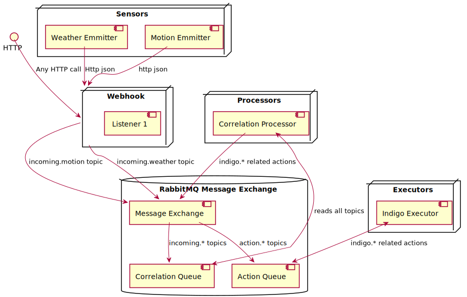

# Cava

Abbreviation of *Italian*: Automa cavaliere, lit. "Automaton knight", Leonardo's original robot

## Deployment

All packages are built using GitHub actions and kubernetest manifests
automatically updated. The best way to quickly deploy is to use ansible which
will take care of all secrets generation, etc. Simply run:

```bash
cd ~/code/ansible
ansible-playbook site.yaml --tags cava
```

## Hacking

## Building pre-requisites

We use poetry for dependency management. When pushing a release, we need to
create the requirements.txt file. This is done automatically by the pre-commit
system.

### Webhook

To hack on the primary webhook, simply use `make run-rabbitmq` followed by
`make stop-rabbitmq`.

### Sensor

If you are debugging or writing an sensor, use `make run-webhook`. This will
automatically start rabbitmq and kill it after the main process is killed.

## Intention

A system that will automatically react and fix issues identified in my home automation system.

## Components

- A simple queuing mechanism for capturing events.
- One or more emitters
- A message parsing processor function that will analyze and standardize events
- A correlation function that will tie events to actions to be taken
- An execution system that will take the prescribed actions
- A metrics system to display things occurring through the platform

### Queueing System

A simple system, likely RabbitMQ that can accept inputs on various channels/queues based on the originating event system. Our platform can rely on the fact that messages coming on a specific queue have certain attributes that can be parsed in a specific way.

### Emitters

These can take various forms, one will be an emitter coming directly from Icinga, as an example. Others could be simple webhook programs, etc.

#### Webhook Emitter

Takes any json object and drops it into the Message Exchange queue with `type: webook`

##### High Level Specs

- Should only accept json data, return 400 for bad (non json) data
- Should only emit a copy of the json data to the queue
- Should use /api/v1/:route_key: where :route_key: will be the routing key
- No authentication

#### Icinga Emitter

Listens to the Icinga API and emits messages to the Message Exchange queue with `type: icinga`

### Message Parsing Processor

A system(s) that read from a specific queue and knows how to standardize messages and drop them on the central processing queue.

### Correlation function

A system that has been instructed to react to messages of a specific type and initiates actions to be taken, can also log metrics on frequency of an event.

### Metrics System

Use the current Influxdb, Grafana, etc.

## Diagram



Todo:

- [x] Fix K8s deployments to use env files to generate secrets. Patch them all
  as well so that they all get the same environment variables.
- [ ] Create a "Reader" to use during testing, add to Dev Kustomize
- [x] Add logging to webhook
- [x] Move secrets to k8s secrets and environment variables
- [ ] Sanitize inputs (look at bleach)
- [ ] Add more tests to Webhook
